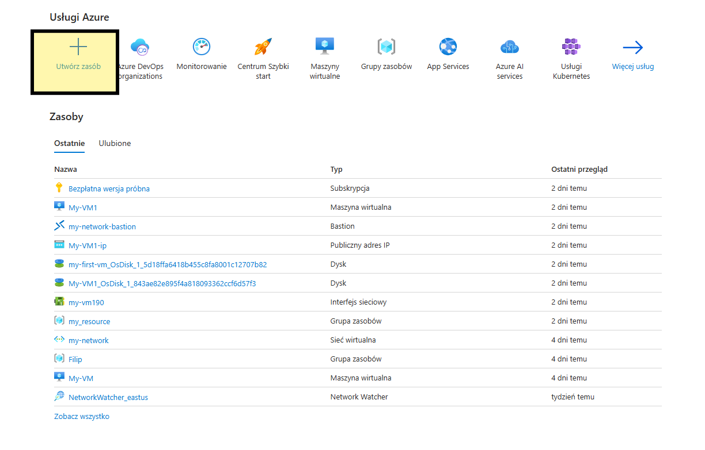
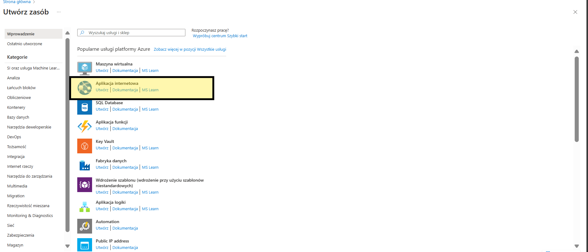
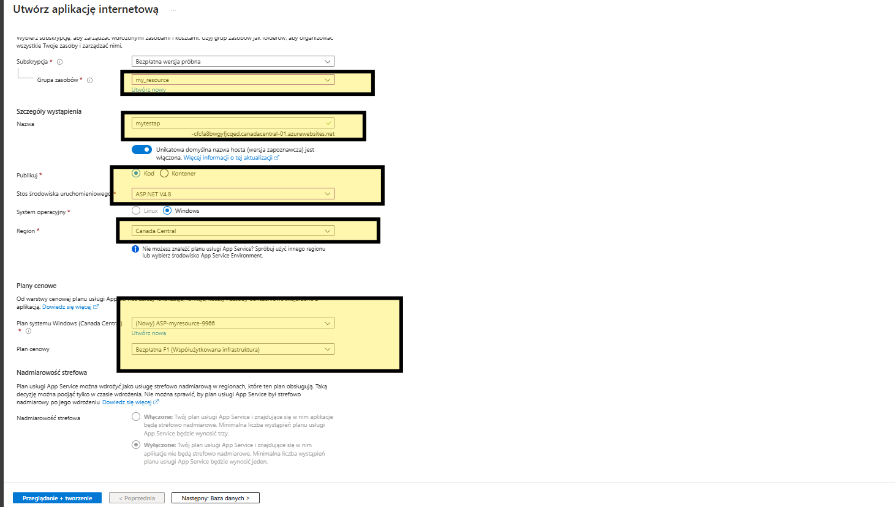
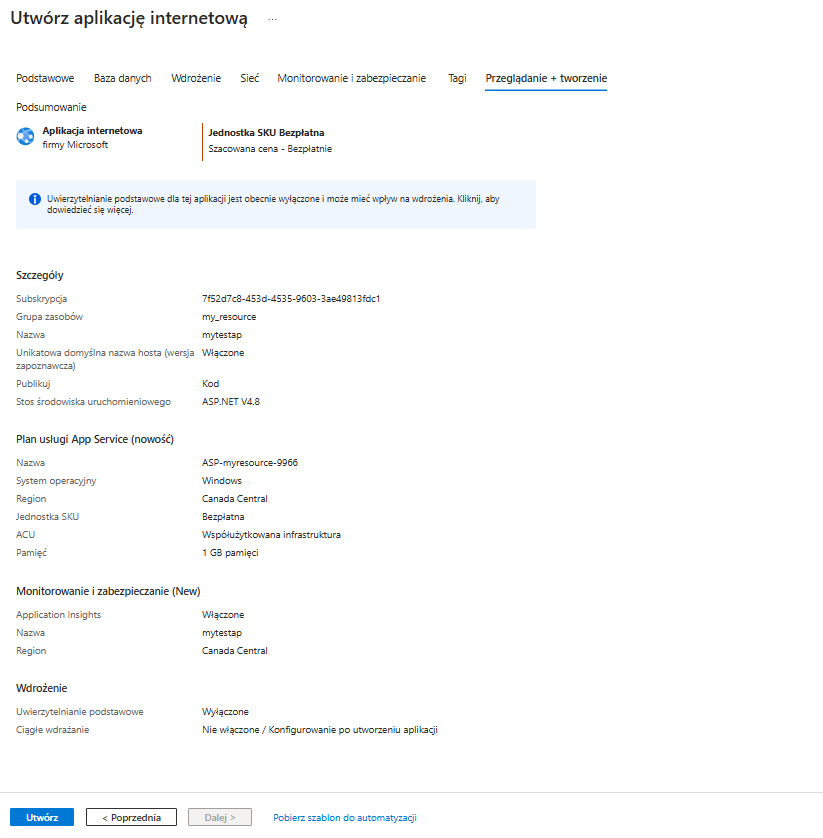
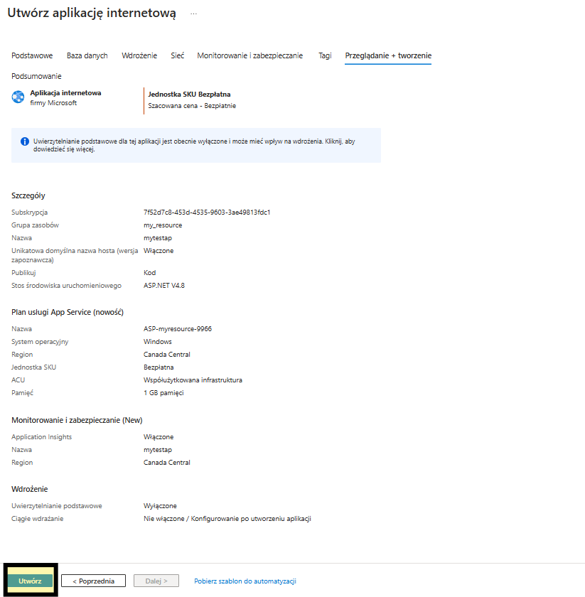
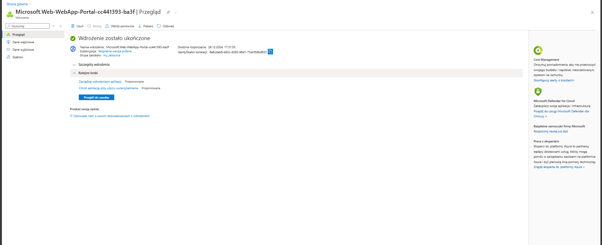
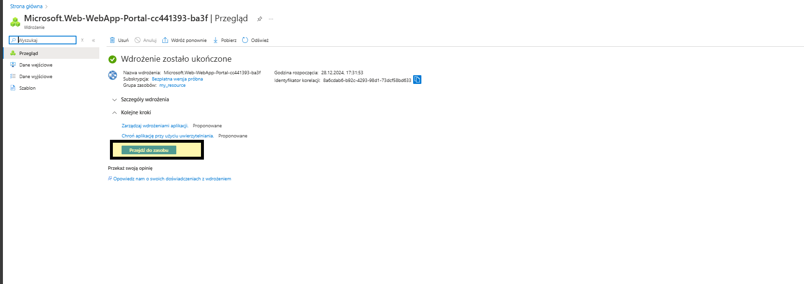
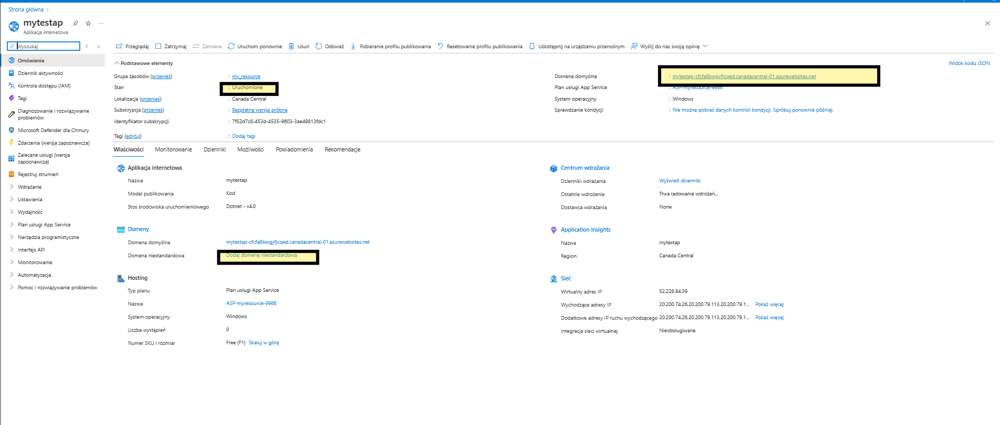

# Azure_App
 How to implementing app

 If you need implemented app go to create resource 

 

 next click internet applicacion

 

 and create your app

 

 and next click create

 

 

 your app will be create

 

next go to resource

now you can check your domain, status, and create nonstandard domain.

If you want add app to your domain check below link

https://learn.microsoft.com/pl-pl/azure/app-service/quickstart-dotnetcore?tabs=netframework48&pivots=development-environment-vs

